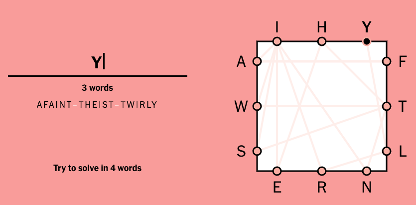
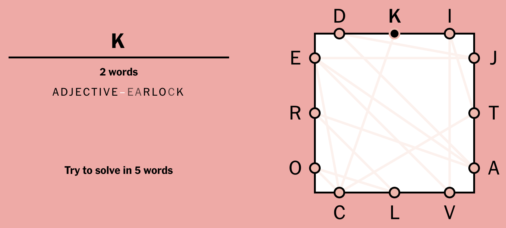

# Solver for Letter Boxed

This is a solver for the New York Times [Letter Boxed puzzle](https://www.nytimes.com/puzzles/letter-boxed). 
Uses the NLTK word list as the default dictionary. Outputs all possible solutions.

## Requirements

* `pip install -r requirements.txt`

## Usage

* `lb.py -h` for help
* `lb.py -t|--top <letters> -l|--left <letter> -b|--bottom <letters> -r|--right <letters>` to solve the puzzle
* Optional parameters:
  * `-m|--min <int>` to specify the minimum word length (default: 4)
  * `-x|--max <int>` to specify the maximum word length (default: no limit)
  * `-d|--depth <int>` to specify the search depth (default: 4)
  * `-D|--dict <file>` to specify the dictionary file (default: NLTK word list)

## Examples

### Example 1 (Constrained search with NLTK words)
> `lb.py -t ihy -l aws -b ern -r ftl -m 6 -x 6 -d 3`
```
1. ['afaint', 'theist', 'twirly']
2. ['atwirl', 'lanseh', 'hafnyl']
3. ['faints', 'shewel', 'lyrate']
...
69. ['wriest', 'tarish', 'hafnyl']
70. ['wriest', 'teaish', 'hafnyl']
71. ['writhe', 'elysia', 'afaint']
```


### Example 2 (Custom dictionary)

❯ `./lb.py -t dki -l ero -b clv -r jta -m 4 -d 2 -D /usr/share/dict/words`
```
1. ['adjective', 'earcockle']
2. ['adjective', 'earlock']
3. ['kokra', 'adjectival']
4. ['okra', 'adjectival']
```


## License
Licensed under the Apache License Version 2.0.


