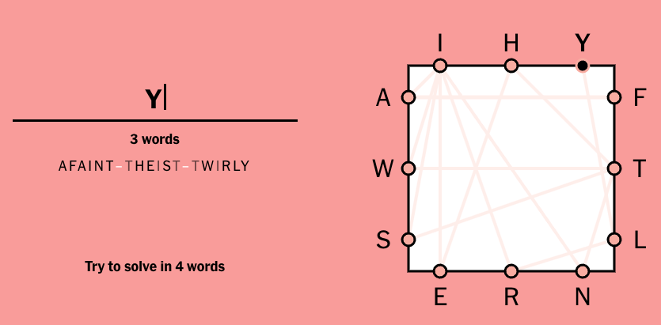

# Solver for Letter Boxed

This is a solver for the New York Times [Letter Boxed puzzle](https://www.nytimes.com/puzzles/letter-boxed). 
Uses the NLTK word list as the default dictionary. Outputs all possible solutions.

## Installation

* `pip install -r requirements.txt`

## Usage

* `lb.py -h` for help
* `lb.py -t|--top <letters> -l|--left <letter> -b|--bottom <letters> -r|--right <letters>` to solve the puzzle
* Optional parameters:
  * `-m|--min <int>` to specify the minimum word length (default: 4)
  * `-x|--max <int>` to specify the maximum word length (default: no limit)
  * `-d|--depth <int>` to specify the search depth (default: 4)

## Example
> `lb.py -t ihy -l aws -b ern -r ftl -m 4 -x 6 -d 3`
```
1. ['afaint', 'theist', 'twirly']
2. ['fains', 'syrtis', 'shewel']
3. ['faint', 'theist', 'twirly']
4. ['faints', 'syrtis', 'shewel']
5. ['fant', 'theist', 'twirly']
6. ['fanwe', 'ehlite', 'estray']
7. ['farset', 'that', 'twinly']
8. ['farset', 'theat', 'twinly']
9. ['farset', 'theist', 'twinly']
10. ['farset', 'tinlet', 'thewy']
11. ['farset', 'that', 'twinly']
12. ['first', 'theat', 'twinly']
13. ['fishet', 'taint', 'twirly']
14. ['fishet', 'tanist', 'twirly']
15. ['fishet', 'tart', 'twinly']
16. ['fishet', 'teart', 'twinly']
17. ['fishet', 'trait', 'twinly']
18. ['fishet', 'trant', 'tewly']
19. ['fishet', 'trant', 'twinly']
20. ['fishet', 'trant', 'twirly']
21. ['fishet', 'twilit', 'trainy']
22. ['fishet', 'twilit', 'tyrant']
23. ['fishet', 'twilit', 'tyrian']
24. ['fishet', 'tyrant', 'tewel']
25. ['fishet', 'tyrant', 'tewly']
26. ['fishet', 'tyrant', 'tweil']
27. ['fishet', 'tyrant', 'twilit']
28. ['fishet', 'tyrant', 'twinly']
29. ['fishet', 'tyrant', 'twirl']
30. ['fishet', 'tyrant', 'twirly']
31. ['fishet', 'tyrant', 'twisel']
32. ['frat', 'theist', 'twinly']
33. ['frist', 'theat', 'twinly']
34. ['infant', 'theist', 'twirly']
35. ['infest', 'that', 'twirly']
36. ['infest', 'theat', 'twirly']
37. ['infest', 'that', 'twirly']
38. ['lewth', 'harish', 'hafnyl']
39. ['wifish', 'hearth', 'hafnyl']
40. ['winish', 'hearth', 'hafnyl']
41. ['wish', 'hearth', 'hafnyl']
42. ['wisha', 'anarya', 'afetal']
43. ['first', 'theat', 'twinly']
```

## License
Licensed under the Apache License Version 2.0.


